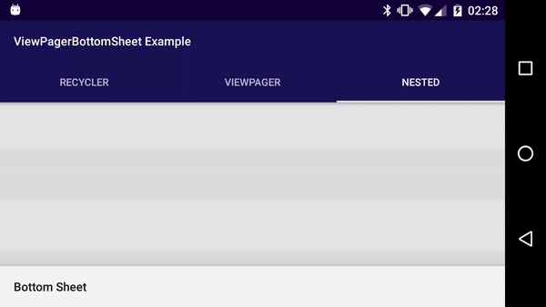
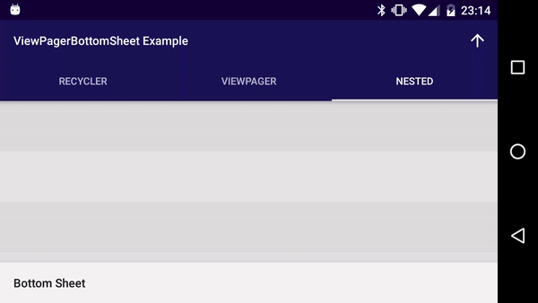

# ViewPagerBottomSheet

Use ViewPagers in Bottom Sheets and Bottom Sheet Dialogs!

## Example

This repository features an example app that demonstrates nested ViewPagers inside a bottom sheet:



## Use for your project

Add the maven repo url to your `build.gradle`:

```groovy
repositories {
    maven { url "https://raw.github.com/laenger/maven-releases/master/releases" }
}
```

Add the library to the dependencies:

```groovy
dependencies {
    compile "biz.laenger.android:vpbs:0.0.4"
}
```

Use `ViewPagerBottomSheetBehavior` for your bottom sheet view:
```
app:layout_behavior="@string/view_pager_bottom_sheet_behavior"
```

Setup any nested `ViewPager` inside the bottom sheet:
```
BottomSheetUtils.setupViewPager(bottomSheetViewPager)
```
(This also works when the ViewPager _is_ the bottom sheet view and for further nested ViewPagers)

## Use with Bottom Sheet Dialogs

Use `ViewPagerBottomSheetDialogFragment` as super-class and setup any `ViewPager` as follows:

```java
public class DialogFragment extends ViewPagerBottomSheetDialogFragment {
    @Override
    public void setupDialog(Dialog dialog, int style) {
        super.setupDialog(dialog, style);
        final View contentView = View.inflate(getContext(), R.layout.dialog_bottom_sheet, null);

        ViewPager viewPager = (ViewPager) contentView.findViewById(R.id.viewpager);
        // ...
        BottomSheetUtils.setupViewPager(viewPager);

        dialog.setContentView(contentView);
    }
}
```



## How does this work?

`ViewPagerBottomSheetBehavior` is essentially identical to the original `BottomSheetBehavior` from the Design Support Library but adds important details: ViewPagers are now properly handled when finding the scrolling child, and this reference can be updated on ViewPager page changes. See the key diff in this commit: [2775715](https://github.com/laenger/ViewPagerBottomSheet/commit/277571585500b8c1ed4ed444a5bd250b981c47fc)
